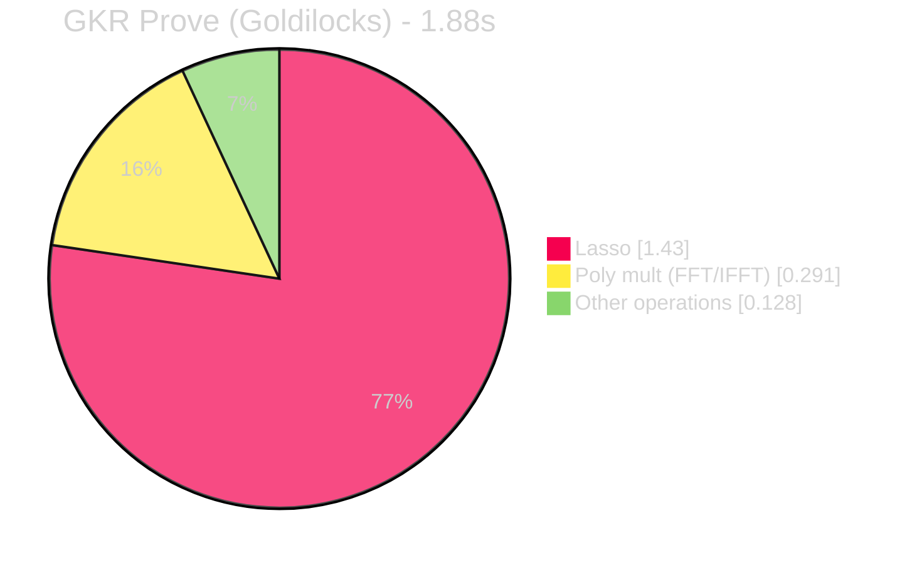
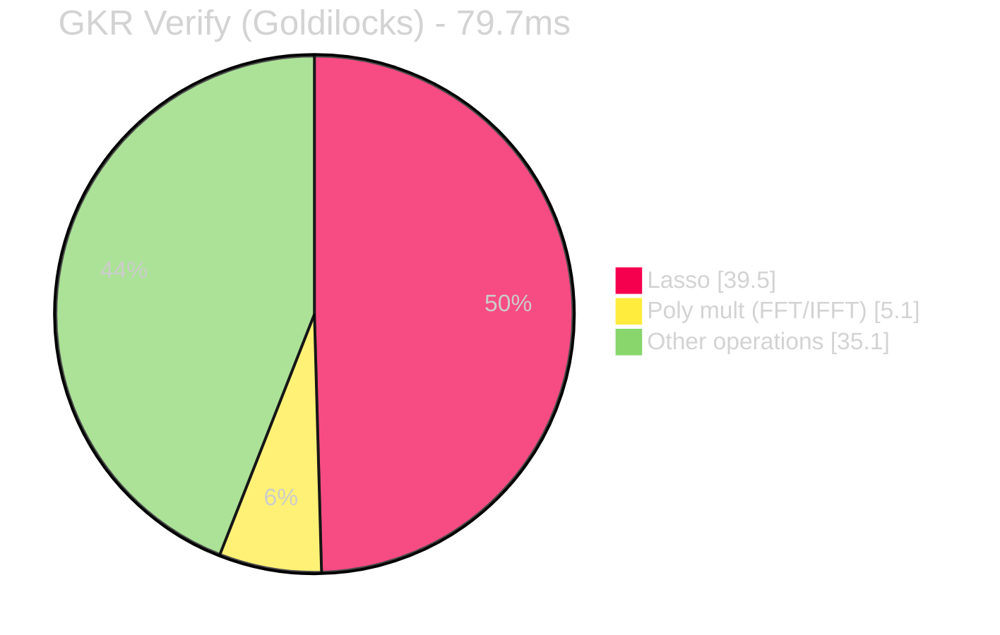

# Hyper-Greco: Verifiable FHE with GKR 

GKR prover for [BFV](https://www.inferati.com/blog/fhe-schemes-bfv) Secret Key Encryption based on [Greco](https://github.com/privacy-scaling-explorations/greco) scheme.

## Approach

- This implementation uses linear-time GKR ([Libra](https://eprint.iacr.org/2019/317)) prove system.
- FHE input uni polys generated via [circuit_sk.py](https://github.com/nulltea/gkreco/blob/1019a9a0a9a174785232cc8e2a21e04861d30ed2/scripts/circuit_sk.py) are converted to multilinear polys on a boolean domain.
- Polynomial multiplication in the circuit is computed as `evaluation (FFT) -> dot product -> interpolation (IFFT)`
  - see 1-D convolution in [zkCNN paper](https://eprint.iacr.org/2021/673.pdf#page=9)
- Range checks for all input polys are batched and proved via a single Lasso node.
- No intermediate commitments; prover can commit to private inputs according to application needs outside this scheme.

### Lasso vs LogUp-GKR 

LogUp was a first choice for range checks. It works really well for smaller tables (e.g. `S_BOUND` and `E_BOUND`) but cannot be naively applied for larger ones. Notably, the `R2_BOUNDS` table is too large, `2**55+`, to be materialized. The [halo2-lib range chip](https://github.com/axiom-crypto/halo2-lib/blob/community-edition/halo2-base/src/gates/range/mod.rs) approach could've been used to remedy this (decomposition and lookup combination), but then Lasso is arguably a better realization of this technique.

Another downside of using LogUp is committing to lookup tables and multiplicities. Lasso avoids this when lookup tables are structured, which is the case for range checks. 

Finally, while multiple lookup input columns can be batched for a single lookup table in LogUp, batching multiple lookup types (range bounds in this case) is impossible with LogUp, afaik. On the contrary, one can batch many lookup types and verify them via a single primary (collation) sum check and two grand product argument GKRs. The approach is inspired by Jolt's [instructions lookups](https://jolt.a16zcrypto.com/how/instruction_lookups.html).

I should note that since `S_BOUND` and `E_BOUND` are small and each only requires a single subtable/dimension, when batching together with other larger-table lookups (which require multiple dimensions per suitable) -- there is a somewhat redundant overhead compared to, say running `S_BOUND` and `E_BOUND` as LogUp nodes. However, when accounting for witness generation and commitment/opening time also needed for LogUp batched, Lasso is still more practical. One approach that has not yet been explored is to have two Lasso nodes: one for small tables and one for large ones.

Version with LogUp checks and LogUP IOP can be found in this [commit](https://github.com/nulltea/gkreco/blob/67eccb9f57a4291a929e38503b8d246d7d7dc8a1/src/sk_encryption_circuit.rs).

## Results

Benchmarks run on M1 Macbook Pro with 10 cores and 32GB of RAM.

The parameters have been chosen targeting 128-bit security level for different values of n. For more information on parameters choise, please check [Homomorphic Encryption Standard](https://homomorphicencryption.org/wp-content/uploads/2018/11/HomomorphicEncryptionStandardv1.1.pdf).

Field/extension field: `Goldilocks, GoldilocksExt2`

|  $n$   | $\log q_i$ | $k$ | Witness Gen | Proof Gen | Proof Verify |
| :----: | :--------: | :-: | :---------: | :-------: | :----------: |
| 1024   |     27     |  1  |    7.23 ms  | 103 ms    | 10.9ms       |
| 2048   |     52     |  1  |   11.9 ms   | 159 ms    | 9.84ms       |
| 4096   |     55     |  2  |  24.73 ms   | 265 ms    | 10.8ms       |
| 8192   |     55     |  4  |   81.5 ms   | 588 ms    | 20.9ms       |
| 16384  |     54     |  8  |   310 ms    | 1.51 s    | 84.9ms       |
| 32768  |     59     |  16 |   1.04s     | 5.06 s    | 107.9ms      |


Field/extension field: `BN254, BN254`

|  $n$   | $\log q_i$ | $k$ | Witness Gen | Proof Gen | Proof Verify |
| :----: | :--------: | :-: | :---------: | :-------: | :----------: |
| 1024   |     27     |  1  | 39.0 ms     | 236 ms    | 22.0 ms      |
| 2048   |     52     |  1  | 77.8 ms     | 308 ms    | 10.1 ms      |
| 4096   |     55     |  2  | 232.2 ms    | 575 ms    | 16.3 ms      |
| 8192   |     55     |  4  | 845 ms      | 1.65 s    | 36.0ms       |
| 16384  |     54     |  8  | 3.55 s      | 4.87 s    | 166 ms       |
| 32768  |     59     |  16 | 12.2 s      | 28.8 s    | 529 ms       |


For comparison, see original [Greco benchmarks](https://github.com/privacy-scaling-explorations/greco?tab=readme-ov-file#results) (proved via Halo2 on M2 Macbook Pro with 12 cores and 32GB of RAM)

### Run yourself
```bash
cargo test -r test_sk_enc_valid  -- --nocapture
```

## Profiling charts





## Known issues & limitations 
- GKR library used is not zero knowledge, thus may leak some sensitive information
- Memory checking in Lasso uses challenge values sampled from the base field (not the extension field), which isn't secure enough when proving over the Goldilocks field
- Number of ciphertexts ($k$) must be a power of two

## Acknowledgements
- [privacy-scaling-explorations/greco](https://github.com/privacy-scaling-explorations/greco)
- [han0110/gkr](https://github.com/han0110/gkr)
- [DoHoonKim8/halo2-lasso](https://github.com/DoHoonKim8/halo2-lasso)
- [a16z/jolt](https://github.com/a16z/jolt)
